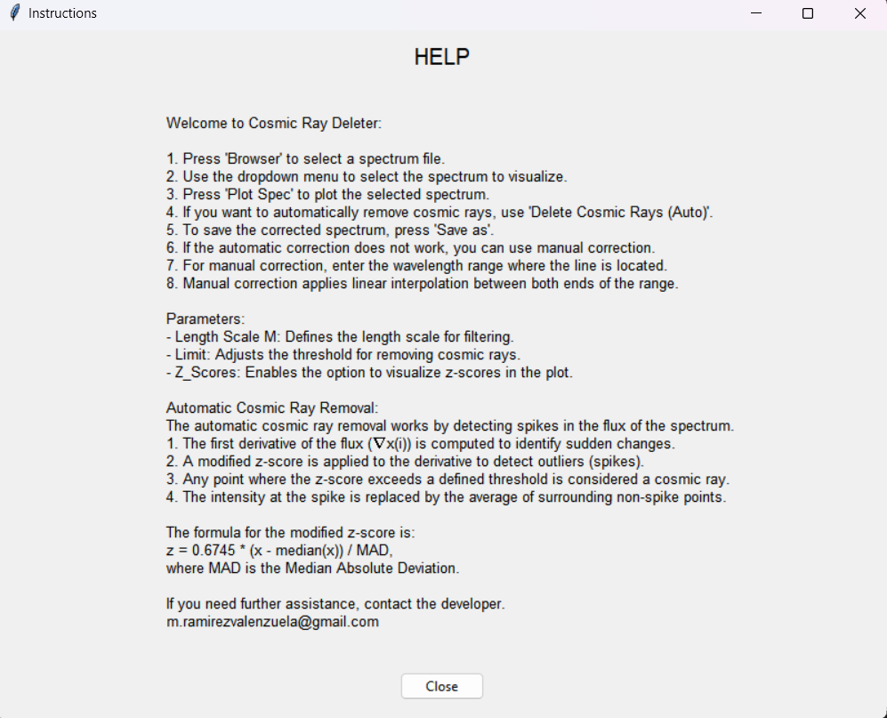

# Cosmic Ray Deleter

**Cosmic Ray Deleter** is a desktop application written in Python using Tkinter, designed to remove cosmic rays from astronomical spectra. The app allows users to visualize their spectra, apply automatic corrections to remove cosmic rays, and manually adjust corrections when needed.

## Key Features

- **Automatic correction**: Automatically detects and removes cosmic rays in the spectra by applying a configurable threshold.
- **Manual correction**: Allows users to select specific ranges in the spectrum and correct the values using linear interpolation.
- **Spectrum visualization**: Load and visualize spectra directly through the graphical interface.
- **Help interface**: A help section that guides users on how to utilize each functionality in the app.
- **IMPORTANT**: The app reads spectrum files in the format provided in the example file uploaded to this repository.

## Screenshots

### 1. Main Menu
The main screen where users can load, visualize, and process their spectra.

### 2. Help Window
A window providing detailed instructions on how to use the various functions of the application.

### 3. Spectrum Visualization
The screen where users can visualize the loaded spectra, apply automatic or manual corrections, and compare the results.

## How to Use the Application

### 1. Load a Spectrum
- Click the **"Browser"** button to select the spectrum file you wish to process. The file should be in a compatible format (e.g., `.txt` or `.dat`).
- Once loaded, the spectrum will appear in the dropdown menu. Select the spectrum you want to visualize.

### 2. Visualize a Spectrum
- After selecting a spectrum from the dropdown menu, click **"Plot Spec"** to display the spectrum in a new graphical window.
  
### 3. Automatically Remove Cosmic Rays
- To automatically remove cosmic rays, adjust the **Length Scale M** and **Limit** parameters.
- Check the **"z_scores"** box if you want to visualize the z-scores of the spectrum.
- Click **"Delete Cosmics rays (Auto)"** to apply the automatic correction.
- A new window will open displaying both the original and the corrected spectrum.

### 4. Manually Remove Cosmic Rays
- For manual correction, input the wavelength range in the **"Start"** and **"End"** fields.
- Click **"Manual Fix"** to apply the correction within the selected range.
- The corrected spectrum will be displayed in a new window, allowing for comparison with the original.

### 5. Save the Corrected Spectrum
- To save the corrected spectrum, click **"Save as"**. Choose the directory where you want to save the file and specify a file name.

## Automatic Correction Parameters

- **Length Scale M**: Defines the filtering length scale (2m+1 points on each side of peaks for correction).
- **Limit**: Defines the threshold to identify cosmic rays. A higher value results in fewer points being marked as cosmic rays.
- **z_scores**: When activated, it shows a plot of the z-scores of the spectrum's derivative to help identify cosmic rays.

## Contributing

Contributions are welcome! If you'd like to improve the code or add new features, feel free to fork this repository and submit a pull request.

## Contact

If you have any questions or need assistance, don't hesitate to contact me:

**Email**: m.ramirezvalenzuela@gmail.com
